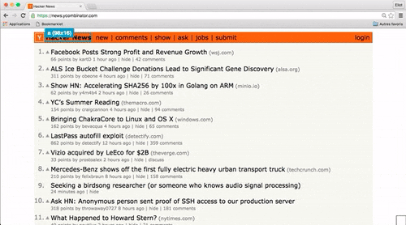

# pixel-perfect-gadget
A bookmarklet to set DOM elements' margin and padding using arrow keys

# Usage
Add the following bookmarklet :

`javascript:(function(){var%20s=document.createElement('div');s.innerHTML='Loading...';s.style.color='black';s.style.padding='20px';s.style.position='fixed';s.style.zIndex='9999';s.style.fontSize='3.0em';s.style.border='2px%20solid%20black';s.style.right='40px';s.style.top='40px';s.setAttribute('class','pixel_perfect_gadget_loading');s.style.background='white';document.body.appendChild(s);s=document.createElement('script');s.setAttribute('type','text/javascript');s.setAttribute('src','https://rawgit.com/EliotAndres/pixel-perfect-gadget/master/ppg.js');document.body.appendChild(s);})();`

Use the arrow keys to move elements. Maintain shift to reduce margin/padding. Toggle mode using (t).

# Technologies

* jQuery
* [jQuery DomOutline](https://github.com/andrewchilds/jQuery.DomOutline)
* Heavily inspired from [SelectorGadget](https://github.com/cantino/selectorgadget)

# Installing
## Dependencies
- npm
- gulp

## Instructions
- Clone the repository
- Run `npm install`
- Run `gulp watch`

# TODO

- [ ] Add exponential increment
- [ ] Switch info window position
- [ ] Add height and width mode
- [ ] Add text size mode
- [ ] Reset Button
- [ ] Add Github page
- [ ] Create Chrome extension
- [ ] Separate CSS ?

Do not hesitate to contribute !
